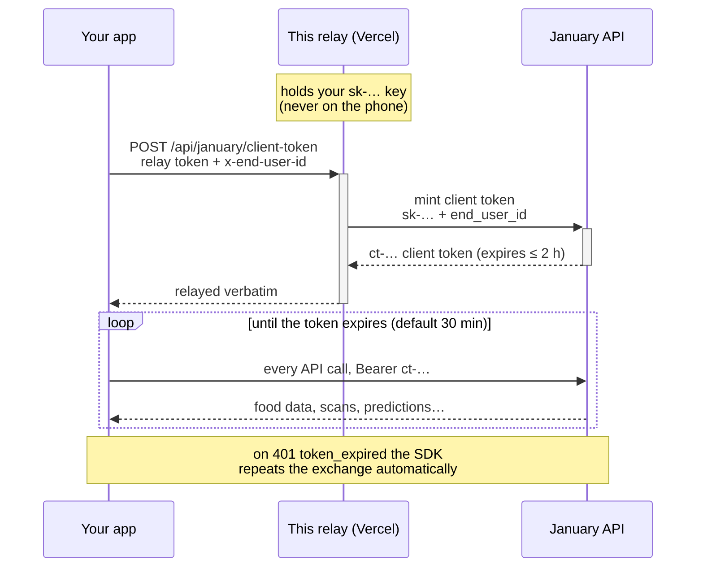

# January Token Relay

[](https://github.com/January-ai/january-token-relay/actions/workflows/ci.yml)


**What this is:** your mobile app needs tokens to call the
[January Developer API](https://docs.january.ai). Tokens are minted with your
API key — and your API key must never ship inside an app, where anyone can
extract it. This relay is the missing middle piece **while you build**: a tiny
service you deploy to Vercel in about a minute, which holds your key and hands
your app short-lived tokens, so the full token flow works before your own
backend endpoint exists.

**Who it's for: development and testing.** You're integrating the January iOS
or Android SDK and want everything working — local builds, demos, a short
TestFlight beta — before your backend team builds the real endpoint. **It is
not a production substitute for your backend:** the relay token proves a
request came from your app, not *which user* is asking. Before launch, move
this endpoint into your backend behind your real user authentication
([how below](#going-to-production-move-the-endpoint-into-your-backend)).

**The three credentials, in plain words:**

| | What it is | Where it lives |
|---|---|---|
| **API key** (`sk-…`) | Your account's master key, from the dashboard | Only in Vercel's vault — never in the app |
| **Relay token** | A password you invent, so only your app can use this relay | In your app; rotate it in Vercel settings any time |
| **Client token** (`ct-…`) | What the relay hands your app: works for one user, dies within 2 hours | In the app's memory; the SDK refreshes it automatically |



The relay is one stateless function with no dependencies. It is called about
once per user per half hour (token refresh), so Vercel's free tier holds
indefinitely.

## Deploy

> **Before you start:** enable **Client tokens** for your account
> (developer dashboard → Client tokens → Enable). Minting is refused with a
> `403` until that toggle is on — the relay will faithfully relay that answer.

[](https://vercel.com/new/clone?repository-url=https%3A%2F%2Fgithub.com%2FJanuary-ai%2Fjanuary-token-relay&env=JANUARY_API_KEY,RELAY_TOKEN&envDescription=JANUARY_API_KEY%3A%20your%20sk-...%20key%20from%20dashboard.january.ai.%20RELAY_TOKEN%3A%20any%20long%20random%20secret%20you%20invent%20-%20your%20app%20sends%20it%20as%20the%20Bearer%20token%20on%20every%20request%20to%20this%20relay.%20Test%20after%20deploy%3A%20curl%20-X%20POST%20https%3A%2F%2FYOUR-PROJECT.vercel.app%2Fapi%2Fjanuary%2Fclient-token%20-H%20'Authorization%3A%20Bearer%20YOUR_RELAY_TOKEN'%20-H%20'x-end-user-id%3A%20demo-user-1'&envLink=https%3A%2F%2Fgithub.com%2FJanuary-ai%2Fjanuary-token-relay%23try-it-from-a-terminal&project-name=january-token-relay&repository-name=january-token-relay)

1. Click the button. Vercel asks where to create your copy of this repo —
   pick your GitHub account (the **Create** button stays disabled until you do).
2. When prompted, enter both values:
   - **`JANUARY_API_KEY`** — mint one in the
     [developer dashboard](https://dashboard.january.ai).
   - **`RELAY_TOKEN`** — a secret you invent. Make it long and random
     (`openssl rand -base64 32` is perfect). This is the value your app sends
     as the `Authorization: Bearer <RELAY_TOKEN>` header when it asks the relay for a token.
3. That's it. Open `https://<your-project>.vercel.app` in your browser — the
   status page confirms the relay is up. Your endpoint is
   `https://<your-project>.vercel.app/api/january/client-token`.

## Try it from a terminal

(Sanity check first, no headers needed: open `https://<your-project>.vercel.app`
in a browser — the status page checks the endpoint for you and shows the two
headers. Neither the page nor a plain GET can mint anything; minting always
requires the POST below.)

```bash
curl -X POST 'https://<your-project>.vercel.app/api/january/client-token' \
  -H 'Authorization: Bearer <your RELAY_TOKEN>' \
  -H 'x-end-user-id: smoke-test-1'
```

A successful answer is January's mint response, relayed verbatim:

```json
{ "token": "ct-…", "expires_in": 1800, "expires_at": "…", "end_user_id": "smoke-test-1", "scopes": ["…"] }
```

Then prove the token works:

```bash
curl 'https://partners.january.ai/v1.2/foods?query=greek+yogurt&limit=3' \
  -H 'Authorization: Bearer <the ct-… you just received>'
```

## Point the SDK at it

```swift
let january = try JanuaryClient(clientTokenProvider: {
    var request = URLRequest(url: URL(string: "https://<your-project>.vercel.app/api/january/client-token")!)
    request.httpMethod = "POST"
    request.setValue("Bearer \(relayToken)", forHTTPHeaderField: "Authorization")
    request.setValue(currentUserId, forHTTPHeaderField: "x-end-user-id")   // your id for the signed-in user
    let (data, _) = try await URLSession.shared.data(for: request)
    return try JSONDecoder().decode(JanuaryClientToken.self, from: data)
})
```

The SDK handles caching, proactive refresh, and the retry-once-on-expiry
contract from there.

## What this protects — and what it doesn't

- **Your API key never leaves the server.** A compromised phone or a
  decompiled app binary cannot reveal it.
- **The relay token is rotatable on its own.** If it leaks, change it in
  Vercel's settings and redeploy — your API key and every other integration
  are untouched.
- **The relay token is still a secret in your app**, and whoever holds it can
  request tokens for any user id they name, until you rotate it. The damage is
  bounded — tokens die within 2 hours, minting is rate-limited, and you can
  revoke any user's tokens from the dashboard — which is acceptable for
  development and a short beta, and is exactly why this relay is **not for
  production**. Before launch, move the endpoint into your backend and let
  your real user authentication decide who can mint
  ([below](#going-to-production-move-the-endpoint-into-your-backend)).
- **Errors are January's errors.** The relay adds exactly one of its own
  (`401 invalid_session`). Everything else — client tokens not enabled (403),
  mint rate limit (429) — passes through verbatim with January's `code`, so
  the SDK's refresh contract keeps working.

## Local development

```bash
npm test          # unit + e2e tests (real HTTP against a stubbed upstream), no network
npm run lint      # Biome — also `npm run format` to auto-fix
vercel dev        # run the endpoint locally with your .env

# Optional: exercise a deployed relay for real (mints one token)
RELAY_E2E_URL=https://<your-project>.vercel.app RELAY_E2E_TOKEN=<your token> npm test
```

## Going to production: move the endpoint into your backend

The relay exists so you can build before your real endpoint does — retire it
before launch. Production minting belongs **inside your backend**, protected
the same way as your other authenticated APIs, so that only your app's
signed-in users can request tokens:

- **Amazon API Gateway + Cognito** — put the endpoint behind a Cognito
  authorizer and read the user id from the verified identity token's claims.
- **Firebase Auth / Auth0 / Clerk / Supabase** — verify the session JWT your
  login system already gives the app, and take the user id from its verified
  claims.
- **Your own sessions** — whatever middleware guards your existing API guards
  this endpoint too; the request's signed-in user is the user you mint for.

Whichever you use, the endpoint performs the same three steps as this relay —
authenticate the caller, mint with your `sk-` key, relay January's response
verbatim — with the one upgrade that makes it production-grade: **the user id
comes from the verified session, never from a request header.** The developer
dashboard's *Production setup* card has copy-paste versions for Node, Python,
and Go. Your app then changes only the URL (and stops sending the relay
token); the SDK behaves identically. Finally, delete the Vercel project and
rotate the API key it held.

---

*January maintainers:* the Deploy button **clones**; clicking it while scoped
to `January-ai` collides with this source repo ("repository already exists").
To host January's own instance, use **vercel.com/new → Import Git Repository**
against this repo instead — imports track pushes to `main`, clones are
point-in-time copies. And the button only works for customers while this repo
is public.
