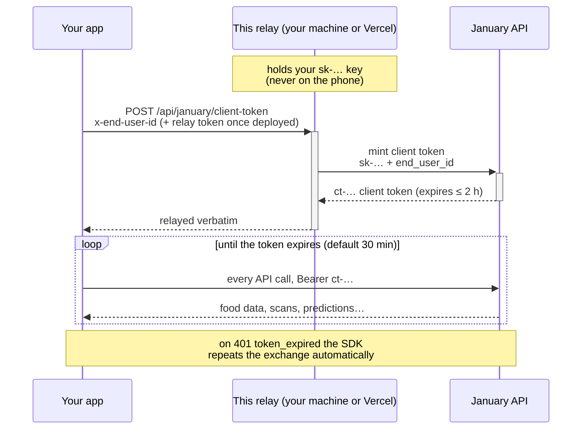

# January Token Relay

[](https://github.com/January-ai/january-token-relay/actions/workflows/ci.yml)


[](https://vercel.com/new/clone?repository-url=https%3A%2F%2Fgithub.com%2FJanuary-ai%2Fjanuary-token-relay&env=JANUARY_API_KEY,RELAY_TOKEN&envDescription=JANUARY_API_KEY%3A%20your%20sk-...%20key%20from%20dashboard.january.ai.%20RELAY_TOKEN%3A%20any%20long%20random%20secret%20you%20invent%20-%20your%20app%20sends%20it%20as%20the%20Bearer%20token%20on%20every%20request%20to%20this%20relay.%20Test%20after%20deploy%3A%20curl%20-X%20POST%20https%3A%2F%2FYOUR-PROJECT.vercel.app%2Fapi%2Fjanuary%2Fclient-token%20-H%20'Authorization%3A%20Bearer%20YOUR_RELAY_TOKEN'%20-H%20'x-end-user-id%3A%20demo-user-1'&envLink=https%3A%2F%2Fgithub.com%2FJanuary-ai%2Fjanuary-token-relay%23try-it-from-a-terminal&project-name=january-token-relay&repository-name=january-token-relay)

*(Deploy needs an API key, and Client tokens enabled on your [January Developer Dashboard](https://dashboard.january.ai). [Full steps below](#deploy))*

*Prefer your own machine? [Run it locally](#run-it-locally) — clone, run `./start.sh`, paste your key. No Vercel account needed.*

## Introduction

Your mobile app needs to call the
[January Developer API](https://docs.january.ai). Calls are authorized with an
API key from the
[January Developer Dashboard](https://dashboard.january.ai) — and an API key
must never ship inside an app, where anyone can extract it.

The best practice for mobile apps is short-lived tokens, one per user, minted
by a **token endpoint on your own backend**:

1. Your app calls a URL on your servers, authorized the same way as every
   other API in your system — so only your signed-in users can reach it.
2. That URL holds your January API key, which is safe there: it lives on your
   server, where clients can't extract it.
3. It calls January's client-token exchange with your key and the user's id,
   and passes the short-lived token it gets back to your app. The app then
   calls January directly with that token until it expires.

**This relay stands in for that URL while you build.** If your backend doesn't
have the token endpoint yet, run this on your own machine with one command, or
deploy it to Vercel in about a minute. Either way it holds your key and hands
your app short-lived tokens, so the full token flow works today — and moves
into your backend unchanged when you're ready. Before launch, move this
endpoint into your backend behind your real user authentication
([how below](#going-to-production-move-the-endpoint-into-your-backend)).

**The three credentials, in plain words:**

| | What it is | Where it lives |
|---|---|---|
| **API key** (`sk-…`) | Your account's master key, from the dashboard | On the server only — your local `.env`, or Vercel's vault — never in the app |
| **Relay token** | A password you invent, so only your app can use a relay that others can reach | In your app when the relay is on Vercel or your Wi-Fi; not needed on your own machine |
| **Client token** (`ct-…`) | What the relay hands your app: works for one user, dies within 2 hours | In the app's memory; the SDK refreshes it automatically |



The relay is one stateless function with no dependencies. It is called about
once per user per half hour (token refresh), so Vercel's free tier holds
indefinitely.

## Run it locally

The relay runs on your own machine with Node 20.12 or newer and nothing to
install. It needs the same two things as a deploy: an API key, and **Client
tokens** enabled in the [developer dashboard](https://dashboard.january.ai)
(Client tokens → Enable — minting answers `403` until it is).

```bash
git clone https://github.com/January-ai/january-token-relay.git
cd january-token-relay
./start.sh
```

The script checks your Node version, asks for your API key (and says where to
create one), confirms the key with January before saving it to a private
`.env`, and starts the relay. When it's up it prints the endpoint to point
your app at, the exact request to make, and each SDK's guide for writing the
token provider. Run it again any time; with a working `.env` it skips straight
to starting, and if the saved key has since been rotated it asks for a new
one. On Windows, run it from Git Bash, or take the manual route:

```bash
cp .env.example .env    # then paste your JANUARY_API_KEY
npm start
```

Your endpoint is `http://localhost:8787/api/january/client-token`, and
`http://localhost:8787` is the status page. The relay listens on loopback
only, so nothing else on your network can reach it — which is why **no relay
token is needed, or checked, on your own machine**; the token exists for
relays other devices can reach. `PORT=…` picks another port. `.env` is
git-ignored, and variables already set in your shell take precedence over it.

- **iOS Simulator** — use `http://localhost:8787/…` as-is. The simulator
  shares your Mac's network, and App Transport Security allows plain `http://`
  to `localhost` by default.
- **A physical iPhone** — start the relay with `HOST=0.0.0.0 ./start.sh`.
  Other devices on your Wi-Fi can now reach the relay, so the script generates
  a relay token for it (your app sends it as `Authorization: Bearer …`) and
  the relay prints its Wi-Fi address (`http://192.168.…:8787/…`) to use in
  the app. On iOS 17 and later, App Transport Security blocks plain `http://`
  to an IP address unless your app's `Info.plist` sets
  `NSAllowsLocalNetworking` to `YES` (the January demo app already does).

## Deploy

> **Before you start:** enable **Client tokens** for your account
> (developer dashboard → Client tokens → Enable). Minting is refused with a
> `403` until that toggle is on — the relay will faithfully relay that answer.

[](https://vercel.com/new/clone?repository-url=https%3A%2F%2Fgithub.com%2FJanuary-ai%2Fjanuary-token-relay&env=JANUARY_API_KEY,RELAY_TOKEN&envDescription=JANUARY_API_KEY%3A%20your%20sk-...%20key%20from%20dashboard.january.ai.%20RELAY_TOKEN%3A%20any%20long%20random%20secret%20you%20invent%20-%20your%20app%20sends%20it%20as%20the%20Bearer%20token%20on%20every%20request%20to%20this%20relay.%20Test%20after%20deploy%3A%20curl%20-X%20POST%20https%3A%2F%2FYOUR-PROJECT.vercel.app%2Fapi%2Fjanuary%2Fclient-token%20-H%20'Authorization%3A%20Bearer%20YOUR_RELAY_TOKEN'%20-H%20'x-end-user-id%3A%20demo-user-1'&envLink=https%3A%2F%2Fgithub.com%2FJanuary-ai%2Fjanuary-token-relay%23try-it-from-a-terminal&project-name=january-token-relay&repository-name=january-token-relay)

1. Click the button. Vercel asks where to create your copy of this repo —
   pick your GitHub account (the **Create** button stays disabled until you do).
2. When prompted, enter both values:
   - **`JANUARY_API_KEY`** — mint one in the
     [developer dashboard](https://dashboard.january.ai).
   - **`RELAY_TOKEN`** — a secret you invent. Make it long and random
     (`openssl rand -base64 32` is perfect). This is the value your app sends
     as the `Authorization: Bearer <RELAY_TOKEN>` header when it asks the relay for a token.
3. That's it. Open `https://<your-project>.vercel.app` in your browser — the
   status page confirms the relay is up. Your endpoint is
   `https://<your-project>.vercel.app/api/january/client-token`.

## Try it from a terminal

```bash
curl -X POST 'http://localhost:8787/api/january/client-token' \
  -H 'x-end-user-id: smoke-test-1'
```

For a deployed relay, use `https://<your-project>.vercel.app` and add
`-H 'Authorization: Bearer <your RELAY_TOKEN>'`.

A successful answer is January's mint response, relayed verbatim:

```json
{ "token": "ct-…", "expires_in": 1800, "expires_at": "…", "end_user_id": "smoke-test-1", "scopes": ["…"] }
```

Then prove the token works:

```bash
curl 'https://partners.january.ai/v1.2/foods?query=greek+yogurt&limit=3' \
  -H 'Authorization: Bearer <the ct-… you just received>'
```

## Point the SDK at it

Every January SDK takes a **token provider**: a small function you write that
calls your token endpoint and returns its JSON as-is. Point it at the relay
with a `POST` carrying `x-end-user-id: <your id for the user>` — plus
`Authorization: Bearer <RELAY_TOKEN>` once the relay is on Vercel or your
Wi-Fi — and the relay's response decodes straight into the SDK's client-token
type. Each guide shows where the provider goes:
[iOS](https://docs.january.ai/ios-sdk/getting-started/authentication),
[Android](https://docs.january.ai/android-sdk/getting-started/authentication),
[React Native](https://docs.january.ai/react-native-sdk/getting-started/authentication),
[Web](https://docs.january.ai/web-sdk/getting-started/authentication).
The guides' sample providers assume *your* backend's request shape, so match
the method and headers to the relay's while it stands in. In Swift:

```swift
import January

// Local relay — or https://<your-project>.vercel.app/api/january/client-token once deployed.
let tokenEndpoint = URL(string: "http://localhost:8787/api/january/client-token")!

let january = try JanuaryClient(
    endUserID: currentUserId,          // your stable id for the signed-in user
    clientTokenProvider: { endUserID in
        var request = URLRequest(url: tokenEndpoint)
        request.httpMethod = "POST"
        request.setValue(endUserID, forHTTPHeaderField: "x-end-user-id")
        // Once the relay is on Vercel or your Wi-Fi, it needs its relay token too:
        // request.setValue("Bearer \(relayToken)", forHTTPHeaderField: "Authorization")
        let (data, _) = try await URLSession.shared.data(for: request)
        return try JSONDecoder().decode(JanuaryClientToken.self, from: data)
    }
)
```

The SDK handles caching, proactive refresh, and the retry-once-on-expiry
contract from there.

The URL itself doesn't matter — any path on any host works, including your own
backend later. What matters is the **shape**: the app POSTs with its
credentials, and the response is January's mint response, verbatim. Any
endpoint honoring that contract is interchangeable with this relay, which is
why moving to your backend changes one string in your app.

## What this protects — and what it doesn't

- **Your API key never leaves the server.** A compromised phone or a
  decompiled app binary cannot reveal it.
- **The relay token is rotatable on its own.** If it leaks, change it in
  Vercel's settings (or `.env`) and restart — your API key and every other
  integration are untouched.
- **On a deployed relay, the relay token is still a secret in your app**, and whoever holds it can
  request tokens for any user id they name, until you rotate it. The damage is
  bounded — tokens die within 2 hours, minting is rate-limited, and you can
  revoke any user's tokens from the dashboard — which is acceptable for
  development and a short beta, and is exactly why this relay is **not for
  production**. Before launch, move the endpoint into your backend and let
  your real user authentication decide who can mint
  ([below](#going-to-production-move-the-endpoint-into-your-backend)).
- **Errors are January's errors.** The relay adds exactly one of its own
  (`401 invalid_session`). Everything else — client tokens not enabled (403),
  mint rate limit (429) — passes through with January's status, `code` and
  `message`, so the SDK's refresh contract keeps working. The two answers that
  mean the relay itself is misconfigured (401: the API key was rejected; 403:
  client tokens not enabled) also carry a `hint` naming the fix.

## Local development

```bash
npm test          # unit + e2e tests (real HTTP against a stubbed upstream), no network
npm run lint      # Biome — also `npm run format` to auto-fix
./start.sh        # guided setup + run; `npm start` runs from an existing .env

# Optional: exercise a deployed relay for real (mints one token)
RELAY_E2E_URL=https://<your-project>.vercel.app RELAY_E2E_TOKEN=<your token> npm test
```

## Going to production: move the endpoint into your backend

The relay exists so you can build before your real endpoint does — retire it
before launch. Production minting belongs **inside your backend**, protected
the same way as your other authenticated APIs, so that only your app's
signed-in users can request tokens:

- **Amazon API Gateway + Cognito** — put the endpoint behind a Cognito
  authorizer and read the user id from the verified identity token's claims.
- **Firebase Auth / Auth0 / Clerk / Supabase** — verify the session JWT your
  login system already gives the app, and take the user id from its verified
  claims.
- **Your own sessions** — whatever middleware guards your existing API guards
  this endpoint too; the request's signed-in user is the user you mint for.