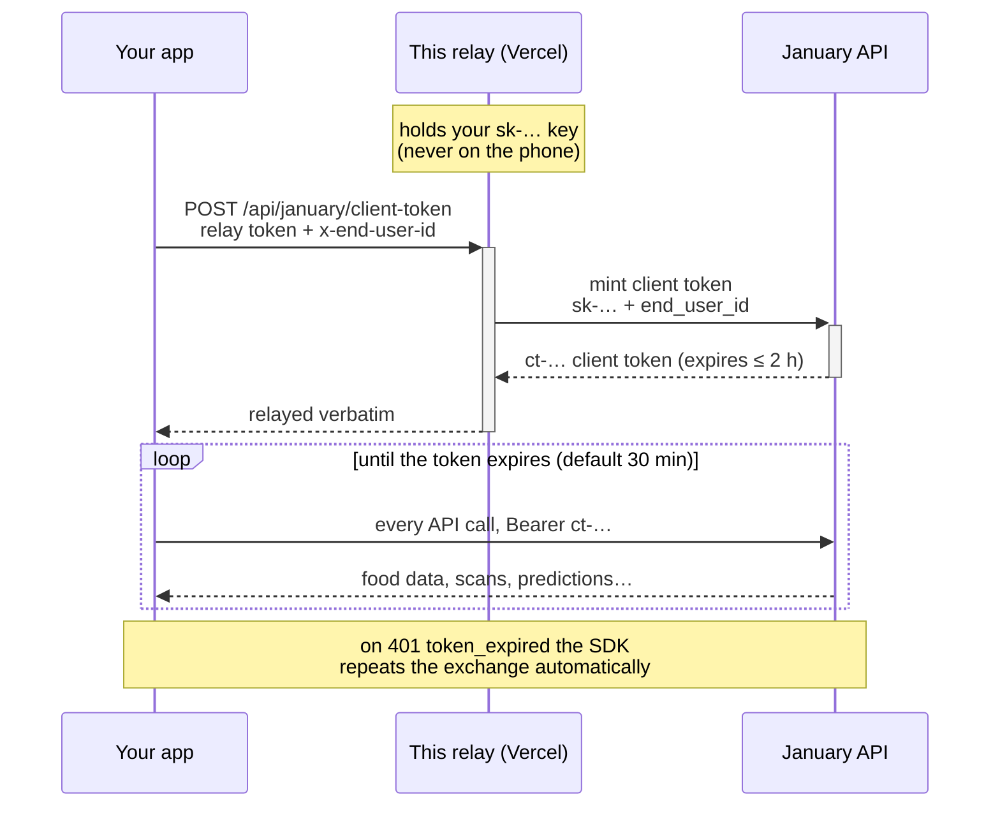

# January Token Relay

The one backend endpoint a January mobile integration needs, deployed in about
a minute. Your app trades a **relay token** (a secret you invent) for
short-lived **client tokens**, and your January API key never ships on a phone
— it lives in Vercel's environment vault and appears only on the
server-to-server call to January.



The relay is one stateless function with no dependencies. It is called about
once per user per half hour (token refresh), so Vercel's free tier holds
indefinitely.

## Deploy

> **Before you start:** enable **Client tokens** for your account
> (developer dashboard → Client tokens → Enable). Minting is refused with a
> `403` until that toggle is on — the relay will faithfully relay that answer.

[](https://vercel.com/new/clone?repository-url=https%3A%2F%2Fgithub.com%2FJanuary-ai%2Fjanuary-token-relay&env=JANUARY_API_KEY,RELAY_TOKEN&envDescription=JANUARY_API_KEY%3A%20your%20sk-...%20key%20from%20dashboard.january.ai.%20RELAY_TOKEN%3A%20any%20long%20random%20secret%20you%20invent%20-%20your%20app%20sends%20it%20as%20the%20Bearer%20token%20on%20every%20request%20to%20this%20relay.%20Test%20after%20deploy%3A%20curl%20-X%20POST%20https%3A%2F%2FYOUR-PROJECT.vercel.app%2Fapi%2Fjanuary%2Fclient-token%20-H%20'Authorization%3A%20Bearer%20YOUR_RELAY_TOKEN'%20-H%20'x-end-user-id%3A%20demo-user-1'&envLink=https%3A%2F%2Fgithub.com%2FJanuary-ai%2Fjanuary-token-relay%23try-it-from-a-terminal&project-name=january-token-relay&repository-name=january-token-relay)

1. Click the button. Vercel asks where to create your copy of this repo —
   pick your GitHub account (the **Create** button stays disabled until you do).
2. When prompted, enter both values:
   - **`JANUARY_API_KEY`** — mint one in the
     [developer dashboard](https://dashboard.january.ai).
   - **`RELAY_TOKEN`** — a secret you invent. Make it long and random
     (`openssl rand -base64 32` is perfect). This is the value your app sends
     as the `Authorization: Bearer` header when it asks the relay for a token.
3. That's it. Your endpoint is live at
   `https://<your-project>.vercel.app/api/january/client-token`.

## Point the SDK at it

```swift
let january = try JanuaryClient(clientTokenProvider: {
    var request = URLRequest(url: URL(string: "https://<your-project>.vercel.app/api/january/client-token")!)
    request.httpMethod = "POST"
    request.setValue("Bearer \(relayToken)", forHTTPHeaderField: "Authorization")
    request.setValue(currentUserId, forHTTPHeaderField: "x-end-user-id")   // your id for the signed-in user
    let (data, _) = try await URLSession.shared.data(for: request)
    return try JSONDecoder().decode(JanuaryClientToken.self, from: data)
})
```

The SDK handles caching, proactive refresh, and the retry-once-on-expiry
contract from there.

## Try it from a terminal

```bash
curl -X POST 'https://<your-project>.vercel.app/api/january/client-token' \
  -H 'Authorization: Bearer <your RELAY_TOKEN>' \
  -H 'x-end-user-id: smoke-test-1'
```

A successful answer is January's mint response, relayed verbatim:

```json
{ "token": "ct-…", "expires_in": 1800, "expires_at": "…", "end_user_id": "smoke-test-1", "scopes": ["…"] }
```

Then prove the token works:

```bash
curl 'https://partners.january.ai/v1.2/foods?query=greek+yogurt&limit=3' \
  -H 'Authorization: Bearer <the ct-… you just received>'
```

## What this protects — and what it doesn't

- **Your API key never leaves the server.** A compromised phone or a
  decompiled app binary cannot reveal it.
- **The relay token is rotatable on its own.** If it leaks, change it in
  Vercel's settings and redeploy — your API key and every other integration
  are untouched.
- **The relay token is still a secret in your app**, and whoever holds it can
  request tokens for any user id they name, until you rotate it. The damage is
  bounded — tokens die within 2 hours, minting is rate-limited, and you can
  revoke any user's tokens from the dashboard — but for an app with real
  users in production, the right upgrade is to verify your login system's
  sessions here instead of a static token: one function to swap in this repo
  (`lib/verify.js`), and the rest of the relay stays identical. Ask us when
  you get there.
- **Errors are January's errors.** The relay adds exactly one of its own
  (`401 invalid_session`). Everything else — client tokens not enabled (403),
  mint rate limit (429) — passes through verbatim with January's `code`, so
  the SDK's refresh contract keeps working.

## Local development

```bash
npm test          # unit tests, no network, no dependencies
vercel dev        # run the endpoint locally with your .env
```

## Moving off the relay later

Nothing to migrate: the relay speaks the same contract as a token endpoint
inside your own backend (authenticate the caller → mint → relay verbatim).
When your backend is ready, implement the same three steps there — deriving
the user id from your real login session — point the SDK at the new URL, and
delete the Vercel project.

---

*January maintainers:* the Deploy button **clones**; clicking it while scoped
to `January-ai` collides with this source repo ("repository already exists").
To host January's own instance, use **vercel.com/new → Import Git Repository**
against this repo instead — imports track pushes to `main`, clones are
point-in-time copies. And the button only works for customers while this repo
is public.
